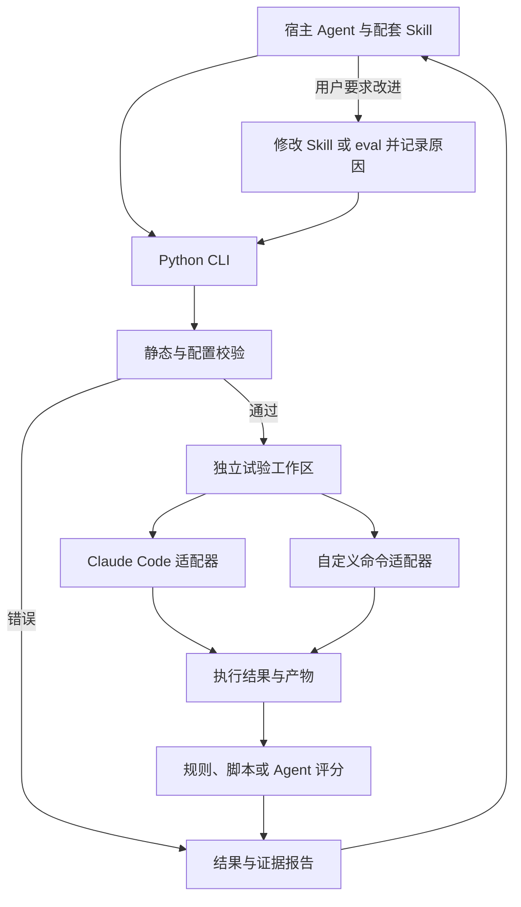

# 架构设计

状态：P0 设计基线；本文件的命令与协议是拟定契约，尚无实现。产品边界见 [需求](requirements.md)，可调整选择见 [决策记录](decisions.md)。

## 模块职责

| 模块 | 职责 | 边界 |
| --- | --- | --- |
| npm launcher / bootstrap | 发现 Python、准备专用环境、启动 Python CLI；分发配套资源 | 不实现评测和评分业务。 |
| cli | 参数、命令、退出码、人类可读输出和 JSON 输出 | JSON stdout 不混入日志；诊断写 stderr。 |
| config / models | 版本化配置、输入、结果、规则和事件模型 | 拒绝不支持的版本及会改变语义的未知配置字段。 |
| validation | 静态 Skill 规则与 eval 配置校验 | 纯本地检查，不执行目标脚本，不调用模型。 |
| workspace | 快照、fixtures、每次试验的工作目录、归档 | 默认复制文件，避免依赖 Windows 符号链接权限。 |
| runner | 用例选择、试验编排、取消、时间限制和状态汇总 | 不了解特定 Agent 的输出格式。 |
| engines | Claude Code、通用本地命令适配 | 统一请求、结果、产物与能力声明；模型连接由 Agent 管理。 |
| judges | 规则、Python 脚本、Agent 评分 | 基于固定标准和执行证据，评分错误有独立状态。 |
| reporting | JSON 持久化与 Markdown/HTML 渲染 | 可从已有结果重建可读报告，不触发重跑。 |
| companion skill | 建例、调用 CLI、解释证据、按需改进 | 使用宿主 Agent 的读写与命令能力；不作为 CLI 内置 Agent loop。 |

优先单进程模块化实现。默认用例并行度为 1，避免首版引入调度服务、数据库和多进程协调。扩展并发不改变单次试验的数据契约。

## 执行与改进的数据流



宿主与执行器可以采用相同 Agent 产品，但不共用用于讨论评分标准的测试会话。执行器与 Agent 评分器也可同款，但评分使用新会话。

## 拟定 CLI

所有命令以下文语义为准；尚不能执行。命令名和参数在实现对应阶段后补齐 `--help`、实例和自动化契约检查。

| 命令 | 输入和行为 | 阶段 |
| --- | --- | --- |
| `skill-assessment --version` | 统一的工具版本 | P1 |
| `skill-assessment doctor` | Python、Agent 命令及运行环境诊断；默认只做本地检查 | P1 |
| `skill-assessment skill install` | 从包内安装配套 Skill；Claude Code 预设目录或显式目标目录 | P1 最小分发验证，P4 完整资源 |
| `skill-assessment check <skill-dir>` | 独立的静态 Skill 校验 | P2 |
| `skill-assessment validate <eval.yaml>` | 只验证 eval 配置及用例引用 | P2 |
| `skill-assessment list-cases <eval.yaml>` | 列出用例及稳定 ID | P2 |
| `skill-assessment run <skill-dir-or-eval.yaml>` | 默认先静态检查，随后执行、评分、归档 | P3 |
| `skill-assessment report <result.json>` | 将已有 JSON 渲染为 Markdown/HTML | P3/P4 |

`run <skill-dir>` 查找该目录的 `evals/eval.yaml`；不存在时给出建例指引，不自动安装 Agent、不自动选择网络服务。`run` 的用例选择、重复次数、对照和父运行参数在 P4 定义。

拟定退出码：0 = 请求成功且所有要求的检查通过；1 = 静态门禁或有效评分未通过；2 = 配置、执行、评分或工具内部错误；130 = 用户取消。混合结果按取消、错误、未通过、成功的顺序确定进程退出码，报告仍保留所有分项状态。validate 的无效 eval 属于配置错误；check 发现 Skill 违规属于静态未通过。

## 配置与路径

拟定最小结构示例，使用本项目 schema v1，不是 skill-up 的兼容配置：

```yaml
schema_version: "1"
skill:
  path: ".."
engine:
  type: claude_code
cases:
  files:
    - cases/basic.yaml
defaults:
  timeout_seconds: 120
report:
  formats: [json, markdown]
```

所有配置内相对文件路径统一相对 `eval.yaml` 所在目录，包括 case 文件中的 fixtures 与评分脚本；Skill 正文中的引用按 Skill 根目录解析。解析后的路径写入运行清单，并保留原始配置以便迁移和诊断。

CLI 显式参数覆盖项目 eval 配置，随后才使用工具默认值。执行器的模型与认证继续使用该 Agent 已有配置；首版不另建一套密钥管理或全局模型配置中心。

配置加载使用安全 YAML 解析并验证类型；禁止重复键静默覆盖。支持 UTF-8、CRLF/LF；BOM 明确处理并可报告建议。范围外路径不能通过字符串替换拼接，需经过路径解析、归档范围和平台兼容检查。

## 静态规则设计

每条结果包含 `rule_id`、`rule_version`、`category`、`severity`、`message`、相对文件路径、可用的行列位置、来源和建议。类别拟定为 `spec`、`engineering`、`advisory`；严重性为 error/warning/info。

| 规则组 | 设计口径 |
| --- | --- |
| 入口与元数据 | 检查入口、YAML 结构、必需字段与类型；缺少必需内容为规格错误。 |
| 命名与约束 | 根据固定规则基线检查命名、目录匹配和字段限制；存在上游歧义时记录项目选择。 |
| 本地引用 | 首版检查可识别 Markdown 本地链接；不请求外部 URL，不把代码示例或预期输出文件当成缺失依赖。 |
| 内容组织 | 长度、组织和可读性属于建议，不能仅因缺少推荐目录或标题而判为规格失败。 |
| 扩展字段 | 保留原始字段；已知 Agent 扩展按 profile 处理，未知字段默认警告，严格策略显式配置。 |

静态引用检查记录覆盖范围，动态拼接路径等无法静态确认的内容标为未覆盖。正文是否足够有效由评测证明，不以简单关键词替代语义结论。

Agent Skills 页面与 skills-ref 对名称字符的表述存在需要对齐的细节；P2 以固定资料和 Unicode 测试样例制定明确规则，不能在升级参考库时悄悄改变判定。详见 [参考资料](references.md)。

## 试验工作区与 Agent 调用

每次运行分配 `run_id`，每个 case × variant × repeat 分配 `trial_id`。冻结本轮 Skill、eval、fixtures、评分标准，复制到各试验目录。评测产物目录不回拷到被测 Skill 源目录。

被测 Agent 仅收到测试输入、声明的 fixtures、目标 Skill 和必要运行配置。`eval.yaml`、用例断言、标准答案、评分脚本及宿主会话不能随 Skill 目录整体复制进入测试环境。测试所需资源采用清单归档；排除规则不能误删 Skill 自身的合法资源。

Claude Code 适配器通过已安装 CLI 的非交互调用方式运行，优先利用结构化输出。实际参数需以安装版本的能力检查和真实验证为准，见 [官方说明](https://code.claude.com/docs/en/headless)。不自动复用 `--continue`/最近会话，不改写用户模型配置。

复用认证配置不等于继承全部工作区状态。适配器应识别影响测试的用户/项目 instructions、全局 Skills、插件和 MCP；尽可能控制目标 Skill 的暴露，记录不能隔离的来源。无法排除 baseline 获得同一目标 Skill 时，将对照标记为无效，不报告增益。

工作目录隔离不是文件系统访问控制。测试进程仍受现有 Agent 的权限配置约束；不默认提升权限或关闭权限机制。需要工具授权而无法非交互完成时，返回可诊断状态。真实外部资源及依赖由用例声明，无法冻结的服务在报告中记录限制。

## 自定义执行器契约草案

v0.1 提供本地命令传输。CLI 写入输入 JSON，通过参数传入输入、输出文件路径，执行器写出输出 JSON。stdout/stderr 作为日志保留；协议结果从指定文件读取，避免日志破坏 JSON。

| 请求字段 | 语义 |
| --- | --- |
| `protocol_version` | 字符串 `1`，与 eval/report 的 schema 独立版本化 |
| `run_id` / `trial_id` / `case_id` | 归档及关联标识 |
| `workspace` | 当前试验的绝对路径 |
| `messages` | 本次试验输入，首版为单轮用户输入；不含评分答案 |
| `skills` | 允许加载的 Skill 路径清单；baseline 对目标 Skill 为空 |
| `limits` | 超时等约束；父进程负责硬性超时和取消 |
| `parameters` | 接入方非敏感扩展参数，不要求指定模型 |

最小成功结果示例：

```json
{
  "protocol_version": "1",
  "status": "completed",
  "final_output": "处理完成",
  "artifacts": [],
  "usage": null
}
```

响应还可携带结构化错误、相对产物路径、工具事件、实际模型标识和会话标识。执行状态 `completed` 只表示执行完成，不表示评分通过。非零进程退出、缺失输出、损坏 JSON、协议版本不匹配和产物越界均转成执行错误，并保留可用证据。

产物必须显式声明，路径基于 workspace，归档前检查是否存在、类型、大小和符号链接/重解析路径的实际指向。暂不支持从任意 URL 自动下载产物。可配置产物数量与体积上限并报告截断。

适配器声明能力，例如文件输入、文件输出、工具轨迹、用量统计、Skill 加载隔离。配置要求的能力不具备时显式报错或标为不支持；不得假装已经执行了相关检查。完整 JSON Schema 和契约测试在 P3 交付。

## Windows 进程管理

- Python 与 Agent 路径可显式指定，也可发现；验证可执行性和版本，不能仅凭命令存在判定可用。
- 区分 exe 与 npm `.cmd` shim；为 `.cmd` 参数转义设计单独验证。长提示词、换行及用户输入优先使用 stdin 或文件传输。
- 使用参数数组与受控工作目录，避免将用户提示词拼接进 shell。支持中文、空格、盘符、反斜杠与 `%` 等特殊字符。
- 显式处理文本编码、换行与二进制产物。增量读取 stdout/stderr，避免管道填满死锁。
- 封装启动、等待、超时、取消和进程树回收；Windows 与 POSIX 采用各自实现。禁止只终止父进程后将残留子进程视作正常完成。
- Git Bash 可作为用户终端；核心启动、安装和评测不依赖 shell 激活 venv，不要求 WSL 或 PowerShell。
- 用户中断后停止新任务，对已完成项归档，原子写入中断状态，避免产生外观完整的成功报告。

## 评分及结果状态

规则评分优先检查确定条件：文本、JSON 字段与文件存在/内容等。Python 脚本评分在单独进程运行，协议、超时和脚本依赖需明确，不能假定工具专用环境包含任意业务包。

Agent 评分接收固定 rubric、允许的参考答案、输出与必要轨迹，在新会话执行。默认使用配置的评分执行器及其已有模型配置；没有单独指定时可复用执行器类型。评分文本来自 Agent 属于推断，原始证据保持独立。

评分 JSON 必须符合约定，缺字段/非法分值记为 `judge_error`，不能默认为通过。评分标准不在同次 run 内被修改。评分时间和用量与任务执行分开记录。

单次试验最终状态：`passed`、`failed`、`execution_error`、`judge_error`、`skipped`、`cancelled`。超时作为错误的具体原因；静态阻断是 run 级原因，其计划试验记为 skipped。

有效评分通过率 = passed / (passed + failed)；评分覆盖率 = (passed + failed) / planned。分母为零时结果为 null，显示“未评分”。同时展示所有状态的数量，禁止只呈现一个忽略执行错误的高通过率。

## 归档与报告

拟定归档清单：

| 相对 run 目录的路径 | 内容 |
| --- | --- |
| `manifest.json` | schema 版本、工具版本、非敏感环境摘要、源内容 hash、输入清单及父运行 ID |
| `result.json` | 规范化静态结果、逐次试验结果、断言证据、统计与限制 |
| `events.jsonl` | 带事件序号、时间和 trial 关联的进度日志；不替代最终结果 |
| `snapshots/` | 本轮 Skill、eval、fixtures、评分规则；不包含完整个人 Agent 配置 |
| `trials/<trial-id>/` | 请求、响应、stdout/stderr、评分结果及显式产物 |
| `report.md` / `report.html` | 从规范化结果生成的阅读视图，资源本地化 |

大文件与产物引用使用相对路径和 hash；源路径可作为受控诊断信息，但阅读报告不能依赖原机器绝对路径。HTML 对模型输出和日志进行转义，不能把被测内容当作页面脚本执行。

运行状态及关键清单原子写入。已完成运行不被覆盖；失败重跑产生新 run 并引用父运行。比较仅在 case、输入、标准和必要执行条件可比时计算差异，变化项单列。

复现意味着恢复已记录输入并重新执行，不保证远端模型逐字确定。seed、模型精确版本或工具轨迹不可获得时如实记录未知；服务可用性和服务端变化是复测的实际限制。

## npm 与 Python 的分发

使用 npm 包交付 launcher、Python wheel、锁定依赖的 wheelhouse、Skill、模板和报告资源。使用者通过内部 registry 获取包，运行时 Python 由本机提供。

bootstrap 根据工具版本、解释器实现/版本和平台定位专用环境，使用 Python venv 和包内依赖安装。安装时指定本地目录和 `--no-index`，避免读取用户 pip 索引配置后意外联网；保留依赖锁定及 hash 校验。[pip 支持本地包安装](https://pip.pypa.io/en/stable/user_guide/#installing-from-local-packages)，[venv 提供独立 Python 环境](https://docs.python.org/3/library/venv.html)。

不分发预先创建的 venv；在目标机器重建。运行使用 venv 解释器绝对路径，不依赖终端激活。安装失败不写完成标记；并发启动需互斥，损坏环境可重建。初始方案在首次 CLI 启动时完成 bootstrap，避免依赖 npm 生命周期脚本必然执行。

构建脚本用 Python 编写，以 Windows + Git Bash 可调用为首要验证路径。构建流程：锁定依赖及其来源、准备离线构建输入、构建 wheel、组装 npm 包、检查包内容、`npm pack`、从 tgz 安装验证；发布是单独步骤，registry/scope 不硬编码。

离线使用要求完整的传递依赖。优先纯 Python 运行依赖；无法取得目标平台 wheel 的依赖不能交给使用者在线编译。包含平台二进制时拆分平台资源并单独验收。开发机依赖准备可使用已配置镜像或离线 wheelhouse；不能在只有 npm 网络的机器上隐式假设 PyPI 可达。

工具依赖与被测 Skill 的业务依赖分别管理。包内 Python 环境只保证工具运行，被测脚本需要的包应在用例依赖说明和 doctor 诊断中展示，不能承诺所有 Skill 开箱即用。
